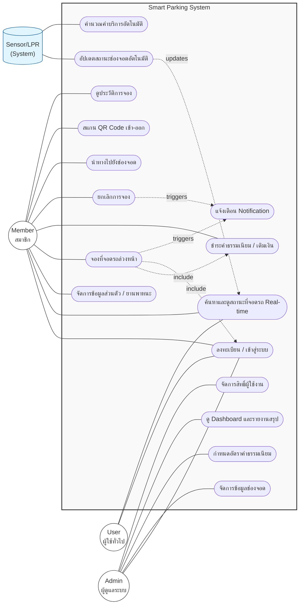

# cp252-lab1

# Requirement document
## Functuonal
1. ระบบจองที่จอดรถล่วงหน้า
2. ระบบตรวจสอบสถานะที่จอดรถแบบ
3. ระบบยกเลิกการจอง
4. ระบบปรับสถานะช่องจอดอัตโนมัติ
5. ระบบคำนวณค่าธรรมเนียม
6. ระบบตรวจสอบจำนวนรถเข้า-ออก
7. ระบบจัดการข้อมูลช่องจอดสำหรับห้างสรรพสินค้า
8. ระบบแจ้งเตือนการจอง
9. ระบบบันทึกประวัติการเข้าจอด
10. ระบบยืนยันตัวตนและการเข้าสู่ระบบ

## TOR
ข้อกำหนดคุณสมบัติระบบบริหารจัดการที่จอดรถอัจฉริยะ (Smart Parking System)

ระบบแสดงผลสำหรับผู้ใช้บริการ (Front-End) ผ่าน Website และ Kiosk มีคุณสมบัติดังนี้

1.1 ปรับปรุง User Interface ของระบบจองที่จอดรถให้มีความทันสมัยใช้งานง่าย และรองรับการใช้งานผ่านอุปกรณ์ที่มีหน้าจอสัมผัสและอุปกรณ์พกพาได้ (Responsive design) โดยใช้เทคโนโลยี Web-Based Application โดยมีสิทธิ์การเข้าใช้งานระบบในเวลาเดียวกันได้ไม่จำกัด และสามารถใช้งานผ่านระบบอินเทอร์เน็ตได้

1.2 มีฟังก์ชันสำหรับการ Log in เข้าสู่ระบบ (ระบบยืนยันตัวตนและการเข้าสู่ระบบ) รองรับการเชื่อมต่อผ่าน Social Media หรือเบอร์โทรศัพท์ และมีระบบช่วยเหลือสำหรับกรณีลืมรหัสผ่าน

1.3 มีหน้าเว็บสำหรับแสดงแผนผังอาคารจอดรถและสถานะช่องจอดแบบ Real-time โดยสามารถแสดงสีหรือสัญลักษณ์ที่ระบุสถานะ ว่าง/ไม่ว่าง/จองแล้ว ตามโซน (Zone) หรือชั้น (Floor) และสามารถเรียงลำดับช่องจอดที่ใกล้ทางเข้าที่สุดได้

1.4 มีหน้าเว็บแสดงโปรโมชั่นที่จอดรถ หรือประกาศแจ้งเตือนการปิดปรับปรุงพื้นที่

1.5 มีหน้าแสดงรายละเอียดของประวัติการเข้าจอด โดยแสดงวันที่ เวลาเข้า-ออก ค่าธรรมเนียม และรูปภาพทะเบียนรถ

1.6 มีกระเป๋าเงินอิเล็กทรอนิกส์หรือจุดเชื่อมต่อการชำระเงินส่วนตัวสำหรับสมาชิก เมื่อสมาชิกทำการเติมเงินหรือผูกบัตรเครดิต ข้อมูลจะถูกแสดงในหน้าข้อมูลส่วนตัว (My Profile) ของสมาชิกนั้นๆ

1.7 การใช้งานระบบจองผ่าน Website มีฟังก์ชันประกอบด้วย
1.7.1 สามารถเลือกวันที่และช่วงเวลาที่ต้องการจองได้
1.7.2 สามารถเลือกโซนจอดรถที่ต้องการได้
1.7.3 มีเมนูสำหรับกดยืนยันการจองและชำระค่าธรรมเนียมล่วงหน้า
1.7.4 แสดงใบยืนยันการจอง (E-Ticket) หรือ QR Code สำหรับสแกนเข้าจอด

1.8 มีพื้นที่ประชาสัมพันธ์ข่าวสารเกี่ยวกับห้างสรรพสินค้าที่หน้าเว็บที่ผู้ดูแลระบบสามารถจัดการได้

1.9 มีหน้าเว็บสำหรับแสดง Profile ของ User ซึ่ง User สามารถปรับเปลี่ยน Profile เองได้ (เช่น ทะเบียนรถที่ใช้งานประจำ และข้อมูลส่วนตัว)

ระบบจองที่จอดรถล่วงหน้าและระบบแจ้งเตือน

2.1 ระบบจองที่จอดรถ สามารถตั้งค่าระยะเวลาการจองล่วงหน้าได้ (เช่น จองล่วงหน้า 1 ชั่วโมง หรือ 1 วัน) ขึ้นอยู่กับการกำหนดค่าของผู้ดูแลระบบ เมื่อผู้ใช้ทำการจอง ระบบจะทำการตัดช่องจอดนั้นออกจากรายการช่องว่างทันทีแบบอัตโนมัติ (ระบบปรับสถานะช่องจอดอัตโนมัติ)

2.2 ระบบยกเลิกการจอง ผู้ใช้งานที่ทำการจองสามารถกดยกเลิกการจองได้ภายในระยะเวลาที่กำหนด หากเกินกำหนดระบบอาจทำการริบค่าธรรมเนียมหรือตัดสิทธิ์ตามเงื่อนไขที่ตั้งไว้

2.3 มีระบบแจ้งเตือนการจอง (Notification) ผ่าน Application หรือ SMS แจ้งเตือนเมื่อการจองสำเร็จ, แจ้งเตือนเมื่อใกล้ถึงเวลาจอง, และแจ้งเตือนเมื่อหมดเวลาจอง

ระบบตรวจสอบและคำนวณอัตโนมัติ

3.1 ระบบตรวจสอบจำนวนรถเข้า-ออก สามารถนับจำนวนรถที่ผ่านไม้กั้นเข้าและออก และแสดงผลจำนวนที่จอดรถคงเหลือแบบ Real-time

3.2 ระบบตรวจสอบสถานะที่จอดรถแบบ Real-time เชื่อมโยงกับอุปกรณ์ Sensor หรือกล้องอ่านป้ายทะเบียน เพื่อระบุว่าช่องจอดใดมีรถจอดอยู่

3.3 ระบบคำนวณค่าธรรมเนียม สามารถคำนวณค่าบริการตามระยะเวลาการจอดจริง รองรับเงื่อนไขการจอดฟรีตามโปรโมชั่น หรือการประทับตรา (E-Stamp)

พัฒนาระบบบริหารจัดการที่จอดรถ ในรูปแบบ Mobile Application

4.1 สามารถใช้งานได้กับอุปกรณ์ระบบ IOS (อุปกรณ์ iPad/iPhone) เวอร์ชันใหม่ล่าสุด

4.2 สามารถใช้งานได้กับอุปกรณ์ระบบ Android OS เวอร์ชันใหม่ล่าสุด

4.3 มีหน้าหลักที่ประกอบไปด้วยเมนูต่างๆ ดังนี้
4.3.1 เมนูค้นหาที่จอดรถและจอง (Booking)
4.3.2 เมนูชำระค่าบริการ (Payment)
4.3.3 เมนูประวัติการจอด (History)
4.3.4 เมนูสมาชิกและโปรโมชั่น

4.4 เมนูการจอง ต้องมีแผนผังแสดงตำแหน่งช่องจอดที่ว่าง และการแบ่งโซน เช่น โซนปกติ, โซน VIP, โซน EV Charger อย่างชัดเจน

4.5 ในแต่ละการจอง ผู้ใช้สามารถกดนำทาง (Navigate) ไปยังช่องจอดที่จองไว้ได้ผ่านแผนที่ภายในอาคาร

4.6 ระบบแจ้งเตือน (Push Notification) ต้องสามารถแจ้งเตือนสถานะต่างๆ ดังนี้
4.6.1 แจ้งเตือนยืนยันการจองสำเร็จ
4.6.2 แจ้งเตือนก่อนหมดเวลาจอง 15 นาที
4.6.3 แจ้งเตือนเมื่อมีการเคลื่อนย้ายรถออกจากช่องจอด (Security Alert)

4.7 ฟังก์ชันสมาชิกและการชำระเงิน
4.7.1 รองรับการชำระเงินผ่าน Mobile Banking, บัตรเครดิต/เดบิต
4.7.2 สามารถบันทึกทะเบียนรถได้มากกว่า 1 คัน
4.7.3 แสดง QR Code สำหรับสแกนเข้า-ออกอาคารจอดรถแทนบัตรจอดรถ

ระบบการจัดการข้อมูลช่องจอดและผู้ดูแลระบบ (Back-End)

5.1 ประกอบด้วยระบบจัดการหลัก ดังนี้
5.1.1 ระบบจัดการข้อมูลช่องจอดสำหรับห้างสรรพสินค้า (Parking Lot Management) สามารถ เพิ่ม ลด ปิดปรับปรุง โซนหรือช่องจอดได้
5.1.2 ระบบจัดการสมาชิก (User Management)
5.1.3 ระบบกำหนดอัตราค่าธรรมเนียม (Fee Configuration)
5.1.4 ระบบจัดการสิทธิ์การเข้าใช้งาน (Role Management)
5.1.5 ระบบบันทึกประวัติการเข้าจอด (Parking Log)
5.1.6 ระบบสถิติและรายงาน (Report)

5.2 ระบบจัดการข้อมูลช่องจอด มีคุณสมบัติดังนี้
5.2.1 สามารถตั้งค่าสถานะช่องจอดได้ (ว่าง, จอง, มีรถจอด, ปิดซ่อมแซม)
5.2.2 สามารถกำหนดประเภทช่องจอดได้ (เช่น Super Car, Disabled, Lady Parking)

5.3 ระบบคำนวณค่าธรรมเนียม รองรับการตั้งค่าที่ซับซ้อน เช่น จอดฟรี 2 ชั่วโมงแรก, ชั่วโมงถัดไปคิดตามอัตราก้าวหน้า หรือส่วนลดสำหรับสมาชิก

5.4 ระบบรายงานการวิเคราะห์ มีฟังก์ชันดังนี้
5.4.1 รายงานสรุปเชิงกราฟิก (Dashboard) ที่สรุปตามช่วงเวลาที่กำหนดได้ (รายวัน รายเดือน รายปี)
- จำนวนรถเข้า-ออกทั้งหมด
- รายได้จากค่าธรรมเนียมที่จอดรถ
- ช่วงเวลาที่มีการใช้งานหนาแน่น (Peak Hours)
- อัตราการเข้าใช้พื้นที่ (Occupancy Rate)
- สถิติการจองผ่านระบบออนไลน์เทียบกับ Walk-in
- ยอดการชำระเงินแยกตามช่องทาง (เงินสด/ออนไลน์)

 5.4.2 รายงานเชิงตาราง ที่สรุปตามช่วงเวลาที่กำหนดได้ และสามารถ Export เป็นไฟล์ Excel ได้
     - รายงานประวัติการเข้า-ออกของรถแต่ละคัน (Log Book)
     - รายงานการยกเลิกการจอง
     - รายงานรายได้ประจำวัน
     - รายงานรถค้างคืน (Overnight Parking)
     - รายงานสถิติสมาชิกที่มียอดการใช้บริการสูงสุด (Top Users)

อุปกรณ์และฮาร์ดแวร์สำหรับติดตั้งในระบบ

6.1 ผู้รับจ้างต้องสามารถจัดหาและติดตั้งอุปกรณ์ Sensor, กล้องอ่านป้ายทะเบียน (LPR), และไม้กั้นอัตโนมัติ ที่สามารถเชื่อมต่อกับระบบซอฟต์แวร์ได้อย่างสมบูรณ์

6.2 ทั้งนี้ ซอฟต์แวร์บริหารจัดการที่จอดรถที่นำเสนอต้องเคยถูกติดตั้งและใช้งานภายในองค์กรของรัฐ หรือห้างสรรพสินค้า หรืออาคารสำนักงานเอกชนมาแล้วอย่างน้อย 5 องค์กร

คุณสมบัติผู้เสนอราคา

7.1 ผู้เสนอราคาหรือผู้รับจ้าง ต้องไม่เป็นผู้ที่ถูกระบุชื่อไว้ในบัญชีรายชื่อผู้ทิ้งงานของทางราชการ และได้แจ้งเวียนชื่อแล้ว หรือไม่เป็นผู้ที่ได้รับผลของการสั่งให้นิติบุคคล หรือบุคคลอื่นเป็นผู้ทิ้งงานตามระเบียบของราชการ

7.2 ผู้เสนอราคาหรือผู้รับจ้างหากไม่ได้เป็นเจ้าของผลิตภัณฑ์ซอฟต์แวร์โดยตรง จะต้องมีหนังสือแต่งตั้งตัวแทนจำหน่ายหรือสิทธิ์ในการพัฒนาต่อยอดจากเจ้าของผลิตภัณฑ์

